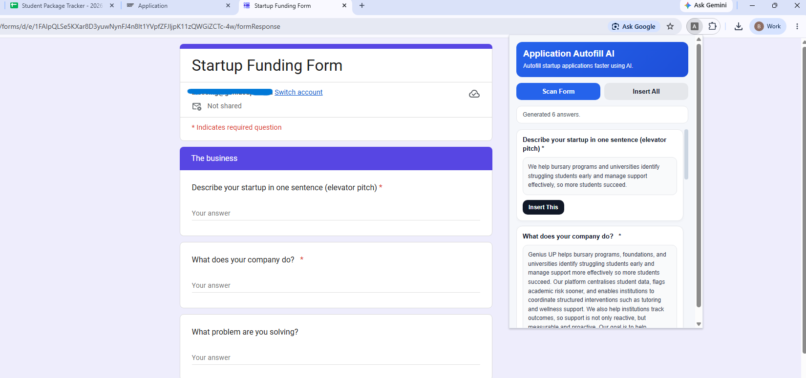

# Application Autofill AI

An AI-powered Chrome extension and Flask backend that helps founders complete repetitive startup, funding, and accelerator application forms faster.

The tool scans visible form fields on a webpage, generates suggested answers using company context, and allows the user to insert answers directly into the form.

---

## Overview

Application Autofill AI was built to solve a real workflow problem: startup and funding applications often ask the same questions repeatedly.

Examples include:

* What problem are you solving?
* Describe your startup in one sentence.
* Who are your customers?
* What traction do you have?
* How does your business make money?
* Why are you the right founder/team to solve this?

Instead of repeatedly copying questions into ChatGPT, rewriting answers, and pasting them back into forms, this tool automates part of that workflow.

---

## What It Does

The tool allows a user to:

* Scan a form on the current webpage
* Detect visible text input fields and questions
* Send those questions to a local Flask backend
* Generate relevant answers using company context
* Insert one answer at a time
* Insert all generated answers into the form

The user can still review and edit the answers before submitting the form.

---

```md
## Demo


```

---

## Features

* Chrome extension popup interface
* Form field detection
* Google Forms support
* Flask backend API
* OpenAI-powered answer generation
* Company profile stored as structured JSON
* Reusable prewritten answers for common application questions
* Fixed answers for factual fields such as name, email, business name, and website
* AI fallback for questions that do not match predefined answers
* “Insert This” button for individual answers
* “Insert All” button for bulk autofill
* Clean popup UI

---

## Tech Stack

* Python
* Flask
* OpenAI API
* JavaScript
* Chrome Extensions
* HTML
* CSS
* JSON

---

## Architecture

The project has two main parts:

```text
Chrome Extension
    ↓
Scans visible form fields/questions
    ↓
Sends extracted fields to Flask backend
    ↓
Backend checks fixed mappings and reusable answers
    ↓
OpenAI generates fallback answers where needed
    ↓
Extension displays answers
    ↓
User inserts answers into the form
```

---

## Project Structure

```text
application-autofill-ai/
│
├── backend/
│   ├── app.py
│   ├── openai_client.py
│   ├── context_loader.py
│   ├── field_mapper.py
│   ├── prewritten_matcher.py
│   ├── answer_type_classifier.py
│   ├── requirements.txt
│   └── data/
│       ├── company_profile.json
│       └── prewritten_answers.json
│
├── extension/
│   ├── manifest.json
│   ├── background.js
│   ├── content.js
│   ├── popup.html
│   └── popup.js
│
├── .gitignore
└── README.md
```

---

## How It Works

### 1. The Chrome extension scans the form

The extension looks for visible input fields and text areas on the current webpage. It also tries to identify the related question or label for each field.

### 2. The backend receives the fields

The Flask backend receives the extracted form questions from the extension.

### 3. The backend generates answers

The backend uses three layers:

1. **Fixed mappings**
   Used for factual fields such as founder name, email, company name, phone number, and website.

2. **Prewritten answers**
   Used for common startup application questions where a strong answer already exists.

3. **AI fallback**
   Used when the question does not match a fixed field or prewritten answer.

### 4. The extension displays suggested answers

The popup shows each detected field and the suggested answer.

### 5. The user inserts answers into the form

The user can choose to insert a single answer or insert all generated answers.

---

## How to Run Locally

### 1. Clone the repository

```bash
git clone https://github.com/blessingmlambo/application-autofill-ai.git
cd application-autofill-ai
```

### 2. Set up the backend

Move into the backend folder:

```bash
cd backend
```

Install dependencies:

```bash
pip install -r requirements.txt
```

Create a `.env` file inside the `backend` folder:

```env
OPENAI_API_KEY=your_api_key_here
```

Run the Flask backend:

```bash
python app.py
```

The backend should run locally on:

```text
http://127.0.0.1:5000
```

---

## How to Load the Chrome Extension

1. Open Chrome.
2. Go to:

```text
chrome://extensions/
```

3. Turn on **Developer mode**.
4. Click **Load unpacked**.
5. Select the `extension` folder inside this project.
6. Pin the extension to your Chrome toolbar.
7. Open a form page.
8. Click the extension icon.
9. Click **Scan Form**.
10. Review and insert the generated answers.

---

## Environment Variables

This project requires an OpenAI API key.

Create a `.env` file inside the `backend` folder:

```env
OPENAI_API_KEY=your_api_key_here
```

The `.env` file should not be committed to GitHub.

---

## Privacy and Security Notes

This project may use sensitive company information to generate answers.

Before making the repository public:

* Do not commit your real `.env` file
* Do not expose your OpenAI API key
* Review `company_profile.json` for sensitive business information
* Review `prewritten_answers.json` before publishing
* Avoid storing private client, student, tutor, or financial information in the repo

This project is intended as a learning project and internal productivity tool.

---

## Key Learning

This project helped me understand:

* How Chrome extensions interact with webpages
* How frontend JavaScript can communicate with a backend API
* How to structure company context using JSON
* How to combine fixed answers, reusable answers, and AI-generated answers
* How to design AI tools around real business workflows
* How to use Git and GitHub to track a real project

---

## Future Improvements

* Add user authentication
* Support more form types
* Improve field detection accuracy
* Add better answer editing before insertion
* Save application history
* Add direct integration with Google Sheets or a CRM
* Add support for multiple company profiles
* Deploy the backend online
* Improve security for production use

---

## Disclaimer

This is an experimental learning project and internal productivity tool. Generated answers should always be reviewed and edited by a human before submission.
